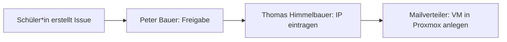

# Anforderungen: VM-/LXC-Anträge über GitHub Issues

Quelle: E-Mail-Verkehr zwischen Michael Wagner und Thomas Stütz (24.–26.09.2026).

## Ziel

Schüler*innen beantragen für ihre Projekte und Diplomarbeiten (DA) eine VM oder einen LXC-Container in der neuen Virtualisierungsumgebung (Proxmox). Der Antrag erfolgt als GitHub Issue (Issue-Template) und durchläuft mehrere Schritte, bis die VM erstellt ist.

Vorbild: [keycloak-antraege](https://github.com/htl-leonding-college/keycloak-antraege/issues) inkl. [Schüler-Leitfaden](https://github.com/htl-leonding-college/keycloak-antraege/blob/main/schueler-leitfaden.adoc).

## Felder der Eingabemaske

Die Felder sollen genau so heißen:

| Feld | Beschreibung |
|---|---|
| **Projektname** | Klein geschrieben, ohne Leerzeichen. Wird Teil des VM-Namens. |
| **Projektbeschreibung** | Kurze Projektbeschreibung: welchen Zweck die VM hat und wie die innere Konfiguration aussieht. |
| **Betreuende Lehrkraft** | – |
| **Teammitglieder** | Vor- und Nachname aller, die am Projekt arbeiten. |
| **Nutzungsdauer** | Wie lange wird die VM benötigt? Wann kann sie gelöscht werden? |
| **Konfiguration** | siehe Unterpunkte |
| └ Public Ports | Welche Ports sollen ins Internet weitergeleitet werden? |
| └ DNS Name | Mit welchem DNS-Namen soll die VM aus dem Internet erreichbar sein? |
| └ Internet: Yes/No | Soll die VM nur schulintern oder auch aus dem Internet erreichbar sein? |
| **Spezielle Anforderungen** | Weitere technische Anforderungen an die VM, die oben nicht erfasst sind. |

## Ablauf

1. **Antrag:** Schüler*in erstellt ein Issue über das Template.
2. **Freigabe:** Peter Bauer bekommt eine Benachrichtigung und gibt das Projekt frei.
3. **IP-Vergabe:** Nach der Freigabe bekommt Thomas Himmelbauer eine E-Mail und trägt die IP-Adresse der VM ein.
4. **Erstellung:** Danach bekommt ein Mailverteiler eine E-Mail und legt mit den Informationen aus dem Issue die VM in der Proxmox-Umgebung an.

## Berechtigungen

- **Alle Issues bearbeiten:** Peter Bauer, Thomas Himmelbauer, Andreas Brückner, Michael Wagner
- **Schüler*innen:** nur eigene Issues

## Ausblick

- Automatische Erstellung der VM in Proxmox (von Michael ausdrücklich erwünscht, laut Thomas vorerst zurückgestellt).

## Entscheidungen (26.09.2026)

- Repo: `htl-leo-infra/vm-antraege`, öffentlich. Org-Basisrecht `none`.
- GitHub-Usernamen: Peter Bauer `bauepete`, Michael Wagner `MWagnerOE5AOO`, Andreas Brückner `Master-Andi`.
- VMs legen Andreas Brückner und Michael Wagner an („Mailverteiler“).
- Benachrichtigung per @-Mention einzelner Personen (GitHub-Mail), vorerst kein SMTP.
- IP-Adresse (privat) darf im öffentlichen Issue stehen.
- Zusätzliche Felder: Typ (VM/LXC), CPU-Kerne, RAM, Disk.

## Offene Punkte

- [ ] GitHub-Username von Thomas Himmelbauer
- [ ] Stufen für CPU/RAM/Disk mit Michael abstimmen (derzeit 1/2/4 Kerne, 1/2/4/8 GB RAM, 10/20/50 GB Disk)
- [ ] Echter Mailverteiler später? (Office365 via Graph API mit Funktionspostfach, Schul-IT)
