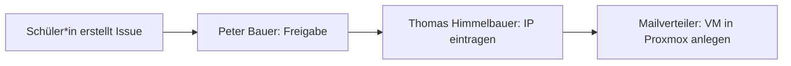

# Anforderungen: VM-/LXC-Anträge über GitHub Issues

Quelle: E-Mail-Verkehr zwischen Michael Wagner und Thomas Stütz (24.–26.09.2026).

## Ziel

Schüler*innen beantragen für ihre Projekte und Diplomarbeiten (DA) eine VM oder einen LXC-Container in der neuen Virtualisierungsumgebung (Proxmox). Der Antrag erfolgt als GitHub Issue (Issue-Template) und durchläuft mehrere Schritte, bis die VM erstellt ist.

Vorbild: [keycloak-antraege](https://github.com/htl-leonding-college/keycloak-antraege/issues) inkl. [Schüler-Leitfaden](https://github.com/htl-leonding-college/keycloak-antraege/blob/main/schueler-leitfaden.adoc).

## Felder der Eingabemaske

Die Felder sollen genau so heißen:

| Feld | Beschreibung |
|---|---|
| **Projektname** | Klein geschrieben, ohne Leerzeichen. Wird Teil des VM-Namens. |
| **Projektbeschreibung** | Kurze Projektbeschreibung: welchen Zweck die VM hat und wie die innere Konfiguration aussieht. |
| **Betreuende Lehrkraft** | – |
| **Teammitglieder** | Vor- und Nachname aller, die am Projekt arbeiten. |
| **Nutzungsdauer** | Wie lange wird die VM benötigt? Wann kann sie gelöscht werden? |
| **Konfiguration** | siehe Unterpunkte |
| └ Public Ports | Welche Ports sollen ins Internet weitergeleitet werden? |
| └ DNS Name | Mit welchem DNS-Namen soll die VM aus dem Internet erreichbar sein? |
| └ Internet: Yes/No | Soll die VM nur schulintern oder auch aus dem Internet erreichbar sein? |
| **Spezielle Anforderungen** | Weitere technische Anforderungen an die VM, die oben nicht erfasst sind. |

## Ablauf

1. **Antrag:** Schüler*in erstellt ein Issue über das Template.
2. **Freigabe:** Peter Bauer bekommt eine Benachrichtigung und gibt das Projekt frei.
3. **IP-Vergabe:** Nach der Freigabe bekommt Thomas Himmelbauer eine E-Mail und trägt die IP-Adresse der VM ein.
4. **Erstellung:** Danach bekommt ein Mailverteiler eine E-Mail und legt mit den Informationen aus dem Issue die VM in der Proxmox-Umgebung an.

## Berechtigungen

- **Alle Issues bearbeiten:** Peter Bauer, Thomas Himmelbauer, Andreas Brückner, Michael Wagner
- **Schüler*innen:** nur eigene Issues

## Ausblick

- Automatische Erstellung der VM in Proxmox (von Michael ausdrücklich erwünscht, laut Thomas vorerst zurückgestellt).

## Entscheidungen (26.09.2026)

- Repo: `htl-leo-infra/vm-antraege`, öffentlich. Org-Basisrecht `none`.
- GitHub-Usernamen: Peter Bauer `bauepete`, Michael Wagner `MWagnerOE5AOO`, Andreas Brückner `Master-Andi`.
- VMs legen Andreas Brückner und Michael Wagner an („Mailverteiler“).
- Benachrichtigung per @-Mention einzelner Personen (GitHub-Mail), vorerst kein SMTP.
- IP-Adresse (privat) darf im öffentlichen Issue stehen.
- Zusätzliche Felder: Typ (VM/LXC), CPU-Kerne, RAM, Disk.

## Entscheidungen (29.09.2026, Mail Michael Wagner)

- Sicherheitshinweis im Leitfaden um Werkzeuge erweitert (Lynis, ClamAV, Fail2Ban, ModSecurity + OWASP CRS, SSH-Härtung).
- Feld **Teammitglieder**: Schul-Benutzernamen statt Namen (z.B. `if123456`; Kürzel ad, kd, if, it, el, bg + 6 Ziffern). Diese Personen bekommen Zugriff auf die Proxmox-GUI.
- Freigabe: Peter Bauer · IP-Vergabe: Sysadmin Thomas Himmelbauer (`ghbugfinder`, ab 30.09.2026) · VM anlegen: Andreas Brückner, Michael Wagner.
- `/ip` akzeptiert Präfix und öffentliche IP (Michaels Test: `/ip 10.9.32.1/24 /public 193.18.22.7/24`).

## Neue Anforderungen (02.10.2026, Mail Michael Wagner)

Nach der Vorstellung am 02.10.2026. Originaltext:

> Es habe sich im Zuge der heutigen Vorstellung noch ein paar Punkte ergeben die noch umgesetzt werden sollen.
>
> - Wenn die Domain angegeben wird dann soll die Prüfung nicht auf htl-leonding.ac.at prüfen.
> - Githubname (eventuell mit Prüfung) des betreuenden Lehrer statt "Name der betreuenden Lehrkraft" Ich weiterer folge soll dann die betreuende Lehrkraft den Antrag prüfen Freigabe der Betreuenden Lehrkraft. Dazu soll ein statt dem Label "freigabe" nun die beiden Lables "AV freigabe" und "Betreuer freigabe".
>   Der Betreuer soll als erstes Freigeben und dann erst Peter.
> - Nachdem die VM angelegt ist soll dann noch eine Checkliste für die Security gemacht werden. Lynis/Fail2Ban/ClamAV/WAF/SSH Härtung
> - Vorgaben bei der Zeit automatisch 1 Jahr. Betreuenden Lehrkraft kann die Zeit verlängern.

Umsetzung (noch offen):

- [ ] **DNS-Name:** keine Einschränkung auf `htl-leonding.ac.at`. Derzeit prüft der Workflow die Domain gar nicht (nur Eindeutigkeit), `htl-leonding.ac.at` steht nur im Platzhalter. Mit Michael klären, wo die Prüfung auftritt.
- [ ] **Betreuende Lehrkraft:** Feld wird GitHub-Username (eventuell mit Prüfung, ob der Account existiert). Die Lehrkraft wird per @-Mention benachrichtigt und gibt als Erste frei.
- [ ] **Zweistufige Freigabe:** Label `status: freigegeben` wird ersetzt durch `status: betreuer-freigegeben` (zuerst, Lehrkraft per `/freigeben`) und danach `status: av-freigegeben` (Peter Bauer). Erst nach beiden geht es zur IP-Vergabe.
- [ ] **Security-Checkliste nach Erstellung:** Bei `status: erstellt` bekommt das Issue eine Checkliste (Lynis, Fail2Ban, ClamAV, WAF, SSH-Härtung) zum Abhaken durch die Schüler*innen.
- [ ] **Nutzungsdauer:** Standard automatisch 1 Jahr. Die betreuende Lehrkraft kann verlängern.

Entscheidungen (03.10.2026, Thomas Stütz):

- **Freigabe durch die Lehrkraft per Kommando** `/freigeben`. Der Workflow akzeptiert es nur von dem GitHub-Account, der im Antrag als betreuende Lehrkraft eingetragen ist. Lehrkräfte brauchen keine Rechte im Repo.
- Feld **Nutzungsdauer** bleibt vorläufig im Formular, dient aber nur zur Information.
- **Labels nach Konvention `status: …`:** `status: betreuer-freigegeben` (statt „Betreuer freigabe“), `status: av-freigegeben` (statt „AV freigabe“). Ablauf: `status: neu` → `status: betreuer-freigegeben` → `status: av-freigegeben` → `status: ip-vergeben` → `status: erstellt`.
- **Ablauf und Verlängerung** wie unten festgelegt, ohne Abstimmung mit Michael. Bei Bedarf wird später angepasst.

### Ablauf und Verlängerung

- **Ablaufdatum:** Bei `status: erstellt` setzt der Workflow das Ablaufdatum auf Erstellung + 1 Jahr. Der Bot schreibt es in seinen Kommentar, sichtbar und als versteckter Marker `<!-- ablauf: JJJJ-MM-TT -->`. Der Bot-Kommentar ist für Schüler*innen nicht bearbeitbar, der Issue-Text schon.
- **Kommando `/verlaengern [Monate]`:** nur von der eingetragenen Lehrkraft oder Team `vm-admins`, sonst ignoriert. Standard 12 Monate, höchstens 12 pro Kommando, gerechnet ab dem bisherigen Ablaufdatum. Der Bot bestätigt mit neuem Datum und Marker und entfernt die Labels `läuft ab` und `abgelaufen`.
- **Workflow `ablauf.yaml`** (täglich per Zeitplan, `issues: write`):
  - 30 Tage vor Ablauf: Label `läuft ab`, Kommentar an Antragsteller*in und Lehrkraft mit Hinweis auf `/verlaengern`.
  - Am Ablauftag: Label `abgelaufen`, Kommentar an Lehrkraft und @VM_ERSTELLUNG, dass die VM gelöscht werden kann.
  - Keine automatische Löschung. Die Admins löschen die VM in Proxmox und schließen das Issue. Geschlossene Issues werden nicht mehr geprüft.
- **Neue Labels:** `läuft ab`, `abgelaufen`.

## Offene Punkte

- [x] GitHub-Username von Thomas Himmelbauer: `ghbugfinder` (30.09.2026, ins Team eingeladen)
- [ ] Stufen für CPU/RAM/Disk mit Michael abstimmen (derzeit 1/2/4 Kerne, 1/2/4/8 GB RAM, 10/20/50 GB Disk)
- [ ] Echter Mailverteiler später? (Office365 via Graph API mit Funktionspostfach, Schul-IT)
